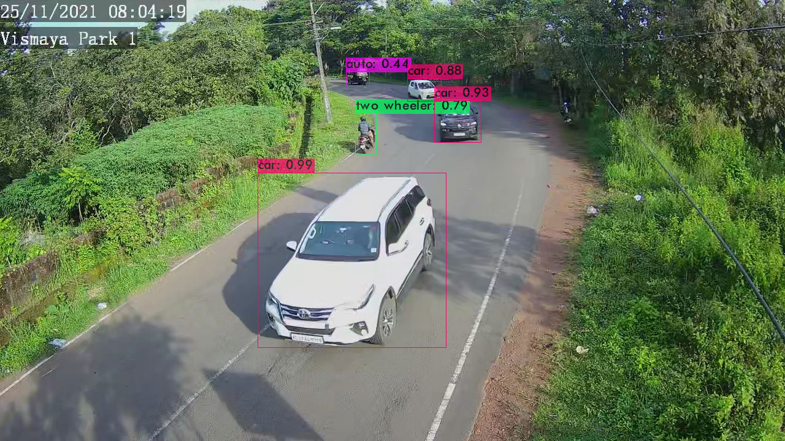

# Vehicle-Detection-AI
The AI interface that detects the features of vehicles.

This repo is a fork of [Darknet](https://github.com/AlexeyAB/darknet). Visit [darknet readme](darknet-README.md)

## YOLOv4 - Custom Training status
### Classes
>auto  
bus  
tempo traveller  
tractor  
truck  
van  
two wheeler  
car  
jcb  

### Learning Chart

### Sample Prediction
.
